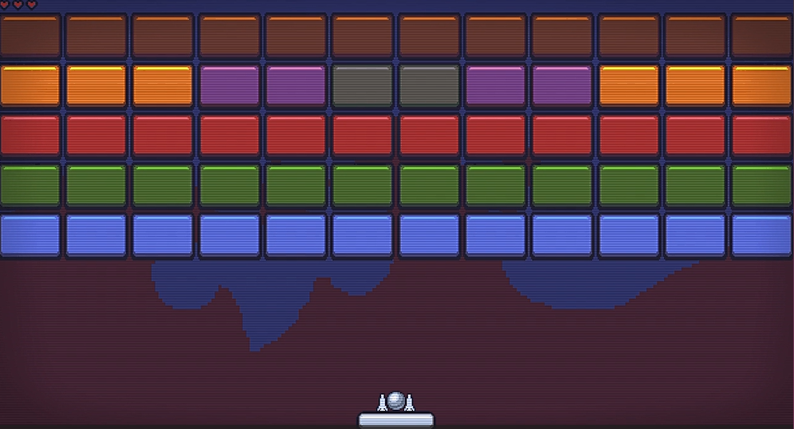
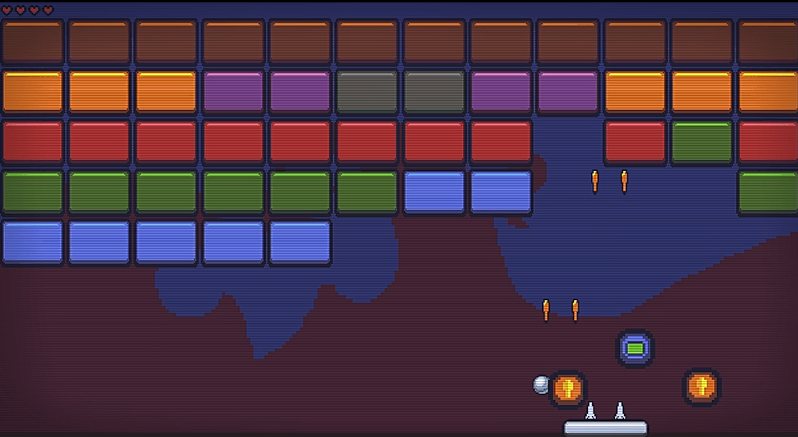
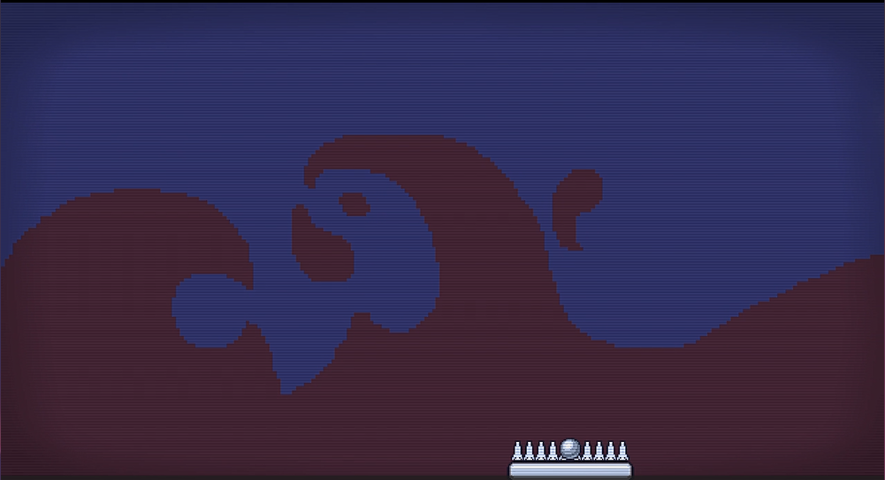

# MiniBreakOut
### Let's Breakout the block!!!

## 프로젝트 요약
 
> 2021.12.27 - 2021.12.30   
 
> **Python 개인 프로젝트**
* Python 기본 강의를 익히고 난 뒤에 진행한 미니 프로젝트입니다.
* PyGame Package를 활용하여 제작하였습니다.
 

> **게임 로직 설명**
* 파이참의 파이게임 라이브러리 설치
* 화면창의 크기:1280 * 720
* RGB 값 각각 BLACK, WHITE, YELLOW, RED를 주었음
* 게임 1프레임당 60초의 간격을 주었음
* 우주선은 화면 창에서 벗어나지 않도록 설정, 운석에 부딪히면 즉시 종료, 미사일을 우주선 정중앙에서 나오도록 함
* 돌은 맞혀지는 즉시 파괴, 우주선이 격추한 운석의 개수에 따라 떨어지는 속도를 달리함
* 미사일은 눌리는 키보드에 따라 위치를 달리해서 나오게끔 설정 --> event 함수 씀
* 파괴 음악, 배경음악, 운석이 폭파하는 음 역시 효과를 랜덤하게 줌
* 운석 역시 30개를 게임창에 넣음으로써 게임할 시 지루함을 덜했음
 

## 시연영상
https://youtu.be/hp4EnCOG29w
